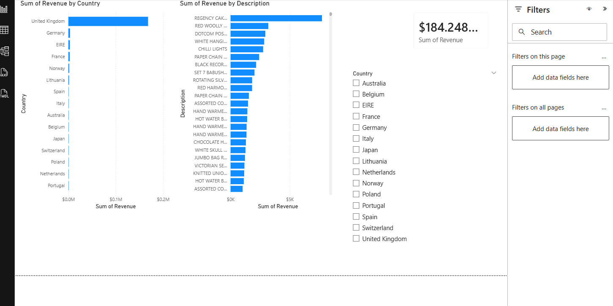

# Retail Sales ETL Pipeline

## Technologies Used
- Python
- Pandas
- PySpark
- SQL
- AWS S3
- Power BI

## Project Overview
Built an end-to-end ETL pipeline for retail sales analytics.

## Features
- Data cleaning
- Null handling
- Duplicate removal
- Revenue analysis
- Dashboard reporting

## Dashboard Screenshot

